# 3D-LiDAR and camera extrinsic calibration [[paper](http://www.mdpi.com/2072-4292/9/8/851/htm)][[arxiv](https://arxiv.org/abs/1708.05514)]
<!-- based on reflectance intensity of the laser -->

[](LICENSE) 

## Citation
If you find our code or method useful in your work, please consider citing this work:

    @Article{WANG2017Lidar_camera_cali,
    AUTHOR = {Wang, Weimin and Sakurada, Ken and Kawaguchi, Nobuo},
    TITLE = {Reflectance Intensity Assisted Automatic and Accurate Extrinsic Calibration of 3D LiDAR and Panoramic Camera Using a Printed Chessboard},
    JOURNAL = {Remote Sensing},
    VOLUME = {9},
    YEAR = {2017},
    NUMBER = {8},
    ARTICLE-NUMBER = {851},
    ISSN = {2072-4292},
    DOI = {10.3390/rs9080851}
    }
    @misc{WANG_ILCC,
      author = {Wang, Weimin and Sakurada, Ken and Kawaguchi, Nobuo},
      title = {ILCC},
      year = {2017},
      publisher = {GitHub},
      journal = {GitHub repository},
      howpublished = {\url{https://github.com/mfxox/ILCC}},
    }


## Introduction

<!-- [[paper]](http://www.mdpi.com/journal/remotesensing)-->
This is an python implementation for the fully automatic and accurate extrinsic calibration of an 3D-LiDAR and the camera based on the laser's reflectance intensity. <br>
__The paper is available [here](http://www.mdpi.com/2072-4292/9/8/851/htm).__<br>
The main features of this implementations are:<br>
1. automatic segmentation of the point cloud acquired by Velodyne 3D LiDAR 
1. automatic detection of the chessboard 
1. automatic corners detection from the chessboard's point cloud
1. optimization for extrinsic calibration parameters
1. various of visualization for 3D point clouds with VTK python wrapper<br>
These features are implemented for VLP-16, HDL-32e and HDL-64e. However, they tested only with HDL-32e. We are appreciated if one could provide data of other types for testing.


## Updates
* 2018-06-05 Add instruction for installing dependencies on Ubuntu.
* 2018-04-16 (Release of Version 0.2) 
    - Implement calibration for monocular camera.
    - Add sample data and results for perspective camera calibration.
    - Add a feature that can hide occluded parts by the chessboard when project the point cloud to the image.
    - Some other minor changes. 


## Dependencies (Tested on macOS sierra and Ubuntu 14.04/16.04)
* Python >= 2.7.9
* [OpenCV](http://opencv.org/) (Remember to [enable python shared library](https://github.com/pyenv/pyenv/wiki) if you are using python installed by  pyenv)
    - for macOS:<br> 
    ```sh
    brew install opencv3
    echo /usr/local/opt/opencv3/lib/python2.7/site-packages >> /usr/local/lib/python2.7/site-packages/opencv3.pth
    ```
    - for Ubuntu:<br> 
    ```sh
    git clone https://github.com/opencv/opencv.git
    cd opencv && mkdir build && cd build && cmake .. && make -j4 && make install
    ```
* [OpenGV](https://laurentkneip.github.io/opengv/page_installation.html)
    - for macOS and Ubuntu:<br> 
    ```sh
    git clone https://github.com/mfxox/opengv
    cd opengv
    mkdir build && cd build && cmake .. && make && make install
    ```
* [Point Cloud Library (PCL)](http://pointclouds.org/)
    - for macOS:<br> 
    ```sh
    brew install pcl
    ```
    - for Ubuntu:<br> 
    ```sh
    sudo apt-get install libpcl-1.7-all
    ```
    or [build from source](http://www.pointclouds.org/documentation/tutorials/compiling_pcl_posix.php)
* [PCL python bindings](<https://github.com/mfxox/python-pcl>)
    - for macOS and Ubuntu:<br> 
    ```sh
    git clone https://github.com/mfxox/python-pcl
    cd python-pcl
    python setup.py install
    ```
* [MATLAB engine for Python](https://www.mathworks.com/help/matlab/matlab_external/install-the-matlab-engine-for-python.html): 
    - for macOS and Linux:<br> 
    ```sh
    cd "matlabroot/extern/engines/python"
    python setup.py install
    ```
    - MATLAB python is used for corner detection from panoramic images. The OpenCV backend is also available which can be set by the __backend__ parameter in ```config.yaml```, however, Opencv may fail to detect the corners. You can also use the example files (__output/img_corners__) of detected corners from the sample data for a try of calibration.
<!-- * Other python packages: pip install -r [requirements.txt](requirements.txt) -->


## Optional
<!-- * [MATLAB engine for Python](https://www.mathworks.com/help/matlab/matlab_external/install-the-matlab-engine-for-python.html): Corner detection from images with MATLAB
   - for macOS or Linux:<br> 
    ```sh
    cd "matlabroot/extern/engines/python"
    python setup.py install
    ``` -->
* [VTK](https://github.com/Kitware/VTK) =7.1.1: 3D Visualization
    - for macOS:<br> 
    ```sh
    brew install vtk
    ```

## Usage
### Installation
```sh
git clone https://github.com/mfxox/ILCC
cd ILCC
python setup.py install
```


### Explanation of files
```config.py```: parameter settings <br>
 ```img_corners_est.py```: estimate corners of chessboard from images with OpenCV or MATLAB<br>
```pcd_corners_est.py```: estimate corners of chessboard from the point cloud<br>
```LM_opt.py```: load corresponding 2D-3D corners, calculate initial values with the PnP method, refine the result with LM method<br>
```utility.py```: utility functions for various of visualization


### Process data
1. Make a folder for example named as __DATA__ and make the image and point cloud folders __DATA/img__ and __DATA/pcd__ respectively. 

1. Put panoramic images into  __DATA/img__ and point cloud files into  __DATA/pcd__. The files should be named like 00XX.png or 00XX.csv.

1. ```cd DATA ``` and copy config.yaml to __DATA__ and modify config.yaml according to your situation.

1. Corner detection from images.<br>
    ```python
    from ILCC import img_corners_est
    img_corners_est.detect_img_corners()
    ```
    Coordinates of corners from images are saved to __DATA/output/img_corners__ with the filename *00XX_img_corners.txt* and images with marked corners are saved in the same folder with the file name *00XX_detected_corners.jpg* if _'output_img_with_dectected_corners'_ in ```config.yaml``` is set to __True__, as shown below.
    <div style="text-align: center">
    
    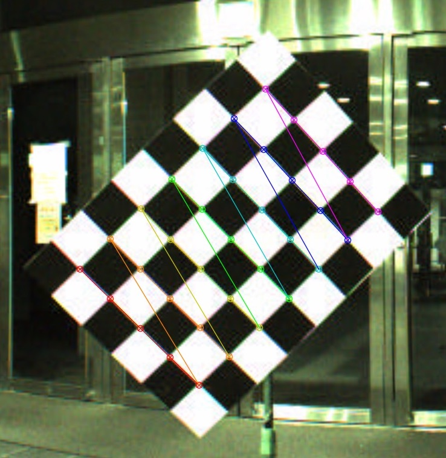
    </div>
1. Corner detection from point clouds.<br>
    ```python
    from ILCC import pcd_corners_est
    pcd_corners_est.detect_pcd_corners()
    ```
    Coordinates of corners from point clouds are save to __output/pcd_seg__ with the filename *00XX_pcd_result.pkl*.  Segments of each point cloud are output to __/DATA/output/pcd_seg/00XX__.
1. Non-linear optimization for final extrinsic parameters.<br>
    ```python 
    from ILCC import LM_opt
    LM_opt.cal_ext_paras()
    ```
    The extrinsic calibration results are output in the end of the process and saved with the filename *YYYYMMDD_HHMMSS_calir_result.txt*.  Images of back-projected 3D corners using the calculated parameters are saved to __DATA/output__ if 'back_proj_corners' is set to **True**, as shown below.
    <div style="text-align: center">
    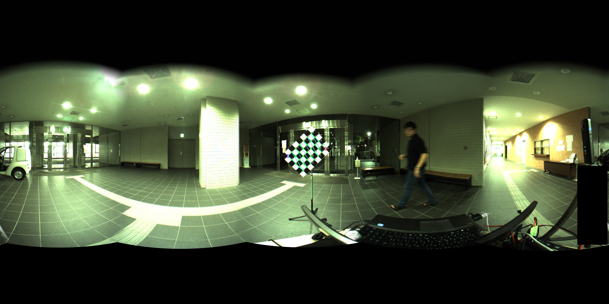
    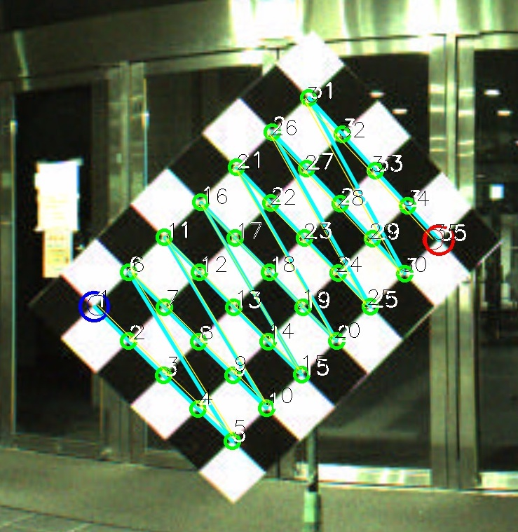<br>
    <!-- <em>Example of panoramic image. </em> -->
    </div>

1. After the aforementioned process, utility module can be imported for visualizing various of results. <br>
    ```python
    from ILCC import utility
    utility.vis_back_proj(ind=1, img_style="orig", pcd_style="dis", hide_occlussion_by_marker=False)
    utility.vis_back_proj(ind=1, img_style="orig", pcd_style="dis", hide_occlussion_by_marker=True)
    utility.vis_back_proj(ind=1, img_style="edge", pcd_style="intens", hide_occlussion_by_marker=True)
    ```
     The image (see below) with back-projected point cloud with the calculated extrinsic parameters will be showed and press "s" for saving. __img_style__ can be "edge" (edge extracted) or "orig" (original image) and __pcd_style__ can be "dis" (color by distance) or "intens" (color by intensity).
    <div style="text-align: center">
    <p align="center"> 
    <br>
    <em>Project points to the original image with coloring by distance.  The occluded part by the chessboard is not hided.</em>
    <br>
    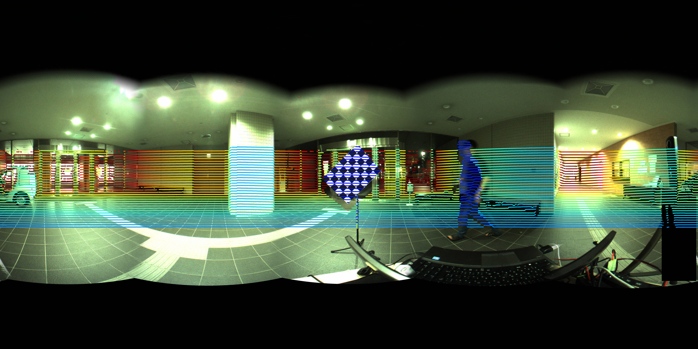<br>
    <em>The occluded part by the chessboard is hided. The occluded part by the chessboard is hided by setting  the parameter hide_occlussion_by_marker True.</em> <br>
    Check the upper part of the chessboard in the two images above.  </em>
    <br>
    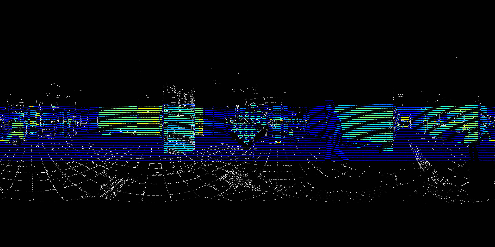<br>
    <em>Project points to the edge image with coloring by intensity. Occluded points by the chessboard are hided.</em>
    </p>
    </div>
    <div style="text-align: center">
    <p align="center"> 
    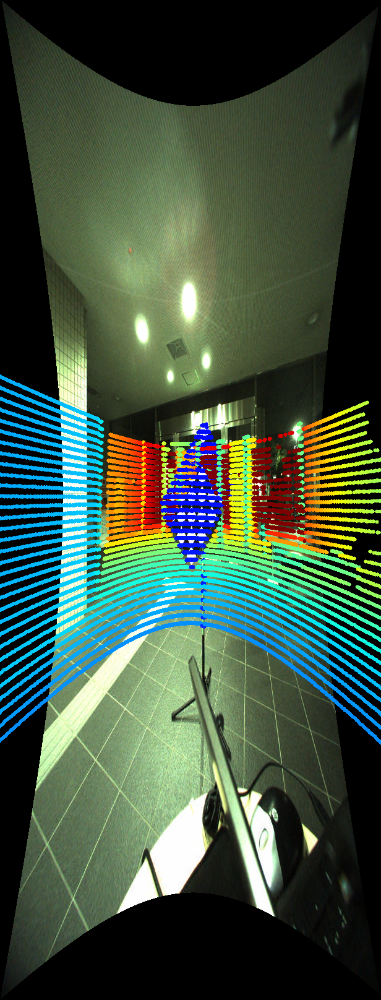
    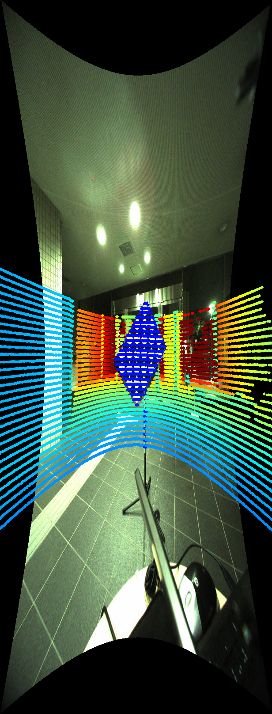
    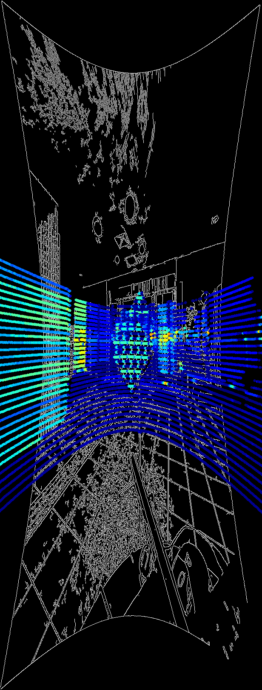
     <br>
    <em>Results of perspective images. From left to right: [color: distance, original image], [color: distance, original image, hide occlusion], [color: intensity, edge image], [color: intensity, edge image, hide occlusion]. </em>
    </p>
    </div>
<!-- 
    <div style="text-align: center">
    <p align="center"> 
    
    
    <em>Hide the occluded part by the chessboard by setting __hide_occlussion_by_marker__ True.</em>
    </p>
    </div> -->

1. For 3D visualization, [VTK](https://github.com/Kitware/VTK) >=7.0 is necessary. See the example below for how to use.


## Example
### Sample Data
The sample data and processing results of detected corners can be downloaded from [here](https://www.dropbox.com/s/m0ogerftqav0fyx/ILCC_sample_data_and_result.zip?dl=0) (181M) for panoramic image and [here](https://www.dropbox.com/s/et0o4k2sp485nz1/ILCC_sample_perspective_data.zip?dl=0) (29M) for perspective image. <br> These data are acquired with the [chessboard file](readme_files/chessboard_A0_0.75_6_8.pdf) which contains 6*8 patterns and the length of one grid is 7.5cm if it is printed by A0 size.
### Process
* For panoramic camera
```sh
wget https://www.dropbox.com/s/m0ogerftqav0fyx/ILCC_sample_data_and_result.zip
unzip ILCC_sample_data_and_result.zip
cd ILCC_sample_data_and_result
```
copy ```config.yaml``` to __ILCC_sample_data_and_result__ folder.


* For perspective camera
```sh
wget https://www.dropbox.com/s/et0o4k2sp485nz1/ILCC_sample_perspective_data.zip
unzip ILCC_sample_perspective_data.zip
cd ILCC_sample_perspective_data
```

copy ```config.yaml``` to ILCC_sample_data_and_result folder.<br/>
Set __camera_type__ to 'perpsective' and input the intrinsic parameters to __instrinsic_para__ by modifying  ```config.yaml``` .


### Visualization ([VTK](https://github.com/Kitware/VTK) >=7.0 is necessary)
* visualization of the point cloud from .csv file
```python
    from ILCC import utility
    utility.vis_csv_pcd(ind=1)
```
<div style="text-align: center">
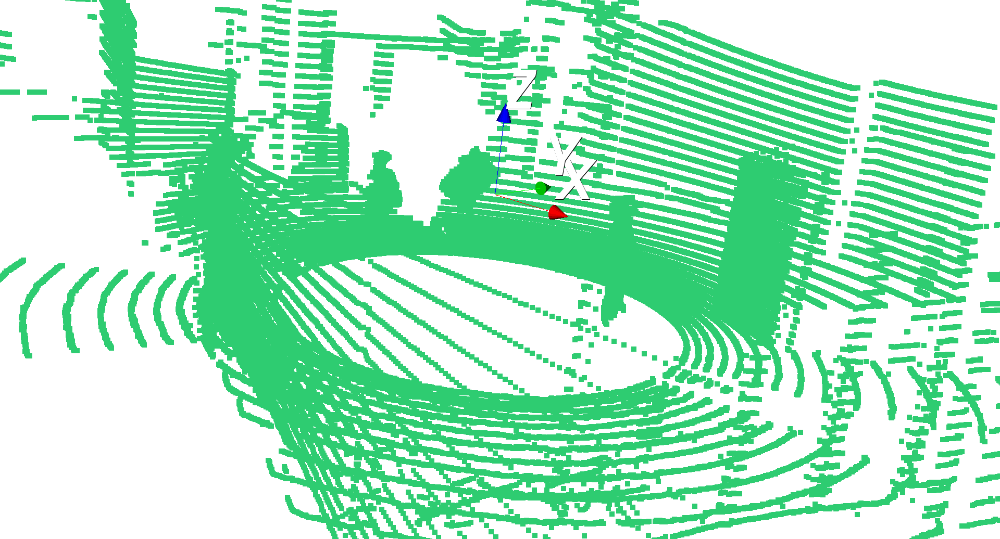
</div>

* visualization of the segmented results
```python
    from ILCC import utility
    utility.vis_segments(ind=1)
```
<div style="text-align: center">
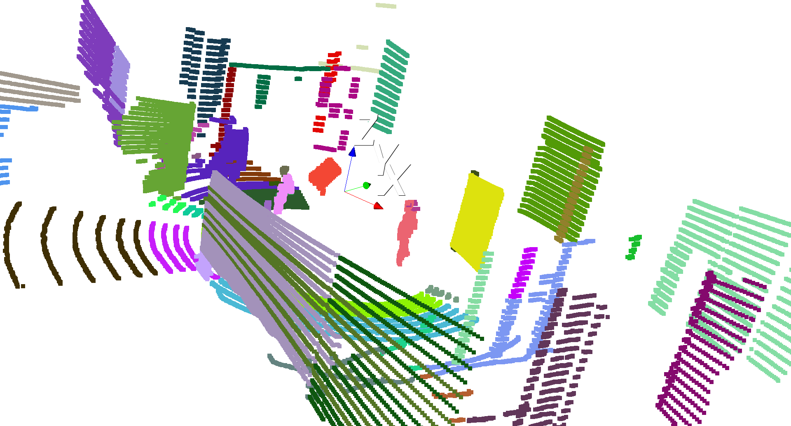
</div>

* visualization of the detected point cloud segment of the chessboard
```python
    from ILCC import utility
    utility.vis_segments_only_chessboard_color(ind=1)
```
<div style="text-align: center">
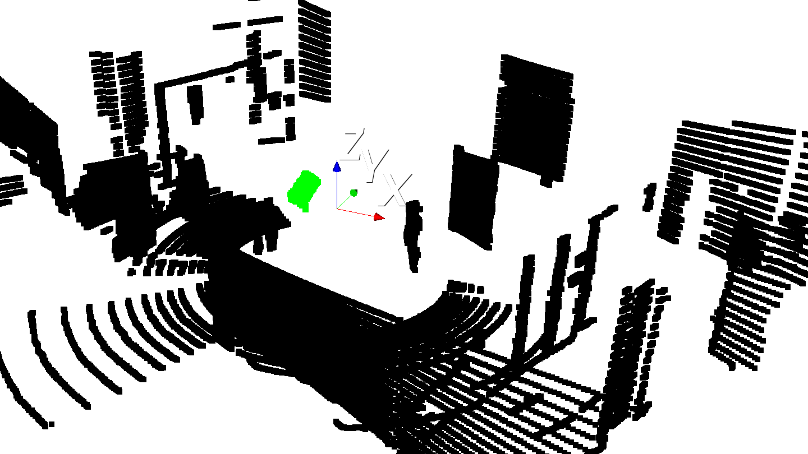
</div>

* visualization of the detected point cloud segment of the chessboard and the estimated chessboard model
```python
    from ILCC import utility
    utility.vis_ested_pcd_corners(ind=1)
```
<div style="text-align: center">
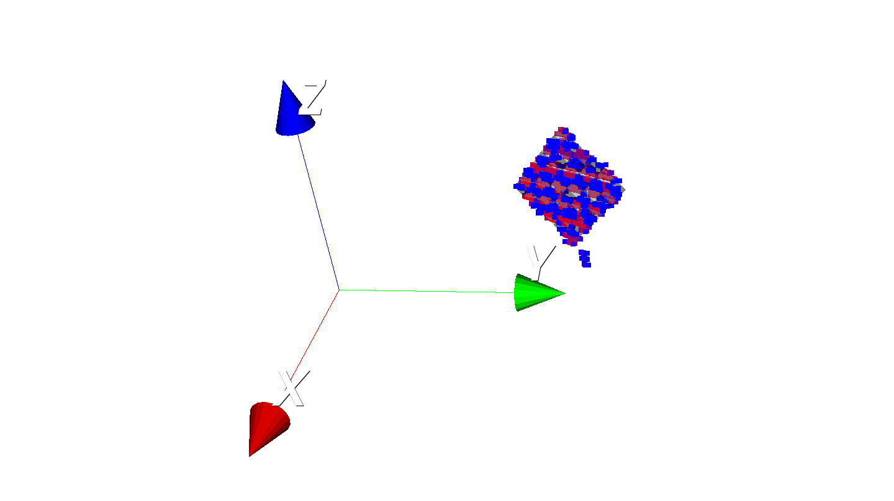
</div>

* visualization of all detected chessboards
```python
    import utility
    import numpy as np
    utility.vis_all_markers(utility.vis_all_markers(np.arange(1, 21).tolist()))
```
<div style="text-align: center">
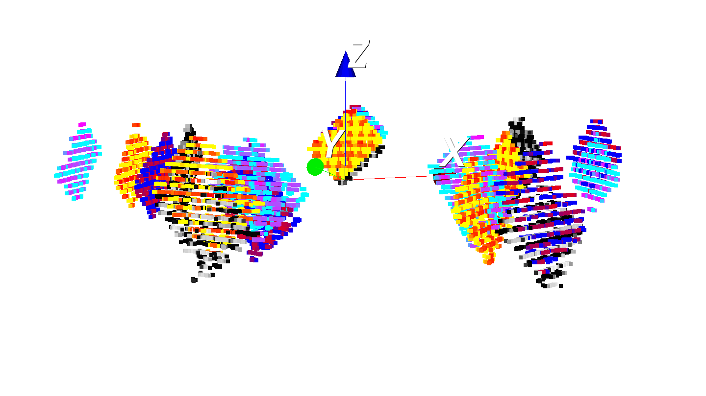

</div>


## Troubleshooting
1. The chessboard was not segmented properly.
* Make sure all points in the *csv* file are according to the time order. 
* Check the *LiDAR_type* and *laser_beams_num* in ```config.yaml``` are the same with your setup.
* Try to increase *jdc_thre_ratio* and *agglomerative_cluster_th_ratio* in ```config.yaml``` if the chessboard is over-segmented. Otherwise, decrease them if the chessboard is under-segmented.

2. The chessboard seems to be segmented properly by visualizing the segmentation result with **utility.vis_segments**, but "no marker is found" or the wrong segment is found.
* Check *pattern_size* and *grid_length* in ```config.yaml``` are set properly.
* Check the approximate distance of the chessboard is less than *marker_range_limit* in  ```config.yaml```.
* Try to increase the value of *chessboard_detect_planar_PCA_ratio* in ```config.yaml``` if the point cloud of the chessboard is very noisy in the normal vector direction.
* Try to decrease the value of *least_marker_points_num* in ```config.yaml``` if the chessboard is very far.

For further questions, please discuss in [Issues](https://github.com/mfxox/ILCC/issues).


## Tested conditions
| No. |    LiDAR Model   | Camera Model | Pattern Size | Grid Length[cm] | Distance Range[m] |                                       Data source                                      |               Author              |
|:---:|:----------------:|:------------:|:------------:|:---------------:|:-----------------:|:--------------------------------------------------------------------------------------:|:---------------------------------:|
|  1  | Velodyne <br> HDL-32e |   Ladybug3 (panoramic)   |      8*6     |       7.5       |      1.2 ~ 2.6      | [link](https://www.dropbox.com/s/m0ogerftqav0fyx/ILCC_sample_data_and_result.zip?dl=0) | [mfxox](https://github.com/mfxox) |
|  2  | Velodyne <br> HDL-32e |   One monocular camera of the Ladybug3   |      8*6     |       7.5       |      1.2 ~ 2.6      | [link](https://www.dropbox.com/s/et0o4k2sp485nz1/ILCC_sample_perspective_data.zip?dl=0) | [mfxox](https://github.com/mfxox) |

## Contributing
We are appreciated if you could share the collected data with different sizes or patterns of chessboard or other types of LiDAR sensors. We will acknowledge your contributions in the tested conditions' list.

If you have any question, please discuss in [Issues](https://github.com/mfxox/ILCC/issues) or contact [me](mailto:weimin@ucl.nagoya-u.ac.jp) directly.


## To do list
<!-- 1. Uniformity check with chi-square test for chessboard detection -->
1. Remove the limitation of the constraints of the consistency between the patterns size and board size.  Make corners detectable with OpenCV.  
1. Integration for ROS
1. <del>Add optimization for perspective camera model</del>(20180416)
1. <del>Add parameters for HDL-64 and VLP-16-PACK</del>(20170614)


